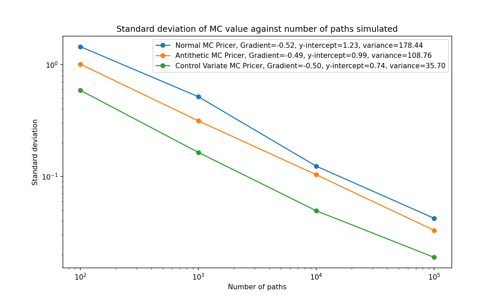
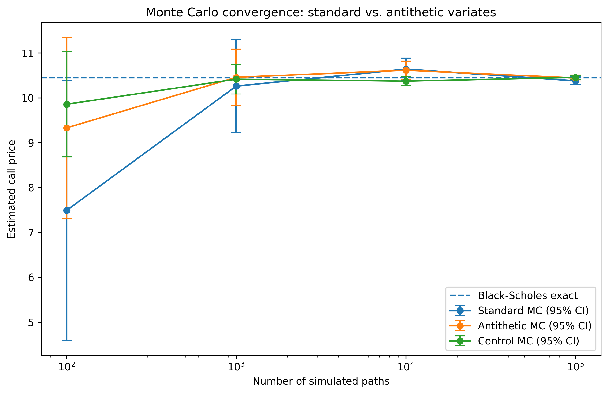

# Monte Carlo Options Pricer with Variance Reduction

A Monte Carlo simulation engine for pricing options under Black-Scholes framework assumptions, supporting European and Asian payoffs and barrier knock-in/knock-out features, with three Monte Carlo variants (naive, antithetic variates, control variates) benchmarked against the closed-form analytical price.

## Features

- European and Asian call/put pricing via simulated GBM price paths
- Barrier knock-in / knock-out overlays (up-and-in, up-and-out, down-and-in, down-and-out)
- Closed-form Black-Scholes benchmark for the plain European case
- Three Monte Carlo estimators — naive, antithetic variates, control variates — compared directly on convergence rate and standard error
- Interactive CLI with input validation for every parameter

## Usage

```
python pricer.py
```

You'll be prompted to choose between:
- **Pricing** — configure and price a specific option (style, type, strike, barrier, etc.)
- **Efficiencies** — run the naive/antithetic/control-variate comparison below against fixed default parameters, producing both plots

## Repository Layout

```
pricer.py     Entry point. Simulates full price paths and prices European,
              Asian, and barrier options via the CLI defined in inputs.py.
analytics.py  Benchmarks Naive / Antithetic / Control Variate MC against
              the closed-form Black-Scholes price for a European call,
              across a range of path counts, producing both plots below.
inputs.py     Interactive CLI prompts, with input validation, for every
              parameter the program needs, plus the Pricing/Efficiencies
              mode choice.
```

## Results

**S₀ = 100, K = 100, σ = 0.2, T = 1, r = 0.05. Analytical price: 10.4506**

| Paths (N) | Naive SE | Antithetic SE | Control SE |
|---|---|---|---|
| 100 | 1.4657 | 1.0725 | 0.5469 |
| 1,000 | 0.4784 | 0.3331 | 0.1718 |
| 10,000 | 0.1368 | 0.1080 | 0.0598 |
| 100,000 | 0.0480 | 0.0310 | 0.0187 |

This log-log graph (with gradient 1/2) confirms the $\mathcal{O}(N^{-1/2})$ convergence behaviour of the Monte Carlo algorithm and the decreasing y-intercepts show the effectiveness of the variance reduction techniques.
We see that the Control Variates technique was particularly effective, reducing the variance to 80.0% of the Naive estimator.



On a log-log axis, standard error against path count is a straight line — the theory behind this is in the [Convergence Rate](#convergence-rate) section below. The fitted gradients (all close to $-0.5$) confirm this, and the vertical gap between the three lines is the variance reduction each technique achieves for the same number of simulated paths. Control variates was the most effective here, cutting the standard error to roughly a third of the naive estimator's at every path count.



---

## Background

### The Pricing Problem

A European call option pays $\max(S_T - K, 0)$ at expiry — the holder profits by $S_T - K$ if the stock finishes above the strike, and the option expires worthless otherwise. Under risk-neutral valuation, its fair price today is that expected payoff, discounted back to the present:

$$C = e^{-rT} \, \mathbb{E}[\max(S_T - K, 0)]$$

Everything below is about evaluating that one expectation — `pricer.py` does it by brute-force simulation, and the derivation further down does it exactly by hand, so the two can be checked against each other.

### Modelling the Stock Price

The underlying asset is taken to follow Geometric Brownian Motion, which gives the price at time $T$ as:

$$S_T = S_0 \exp\left( \left(r - \frac{\sigma^2}{2}\right)T + \sigma \sqrt{T} Z \right), \qquad Z \sim \mathcal{N}(0,1)$$

with PDF $\phi(z) = \frac{1}{\sqrt{2\pi}} e^{-z^2/2}$.

Whilst this formula works for European call option payoffs, an Asian option's payoff depends on the average price of the underlying asset over the option’s life:

$$
\bar{S} = \frac{1}{N} \sum_{i=1}^{N} S_{t_i}
$$

Because the payoff relies on the entire historical path, knowing just $S_T$ isn't enough. You need to record the asset price at discrete observation times $t_1, t_2, \dots, t_N$.

To generate a valid trajectory, you discretize the total time $T$ into $N$ equal steps of size $\Delta t = \frac{T}{N}$:

$$
S_{t_i} = S_{t_{i-1}} \exp\left( \left(r - \frac{\sigma^2}{2}\right)\Delta t + \sigma \sqrt{\Delta t} Z_i \right)
$$

where $Z_i \stackrel{\text{i.i.d.}}{\sim} \mathcal{N}(0,1)$.

### Deriving the Analytical Price

**Splitting the payoff with indicator functions.** The obstacle to evaluating $\mathbb{E}[\max(S_T-K,0)]$ directly is the $\max(\cdot,0)$: it makes the integrand piecewise, zero on one side and $(S_T-K)$ on the other. The standard fix is to replace the $\max$ with an **indicator function** $\mathbb{1}_{S_T>K}$, equal to $1$ when $S_T>K$ and $0$ otherwise:

$$\max(S_T - K, 0) = (S_T - K)\cdot \mathbb{1}_{S_T > K}$$

So,

$$\mathbb{E}[\max(S_T-K,0)] = \mathbb{E}\big[(S_T - K)\cdot \mathbb{1}_{S_T>K}\big] = \mathbb{E}\big[S_T \cdot \mathbb{1}_{S_T>K}\big] \; - \; K\,\mathbb{E}\big[\mathbb{1}_{S_T>K}\big]$$

Two separate expectations now, each with a clean interpretation:

- $\mathbb{E}[\mathbb{1}_{S_T>K}] = P(S_T > K)$ — the probability the option finishes in the money.
- $\mathbb{E}[S_T \cdot \mathbb{1}_{S_T>K}]$ — the expected value of $S_T$ itself, but *only counting* the scenarios where it lands above $K$.


**Locating the exercise boundary.** Both remaining expectations are integrals restricted to "$S_T>K$", so the next step is finding exactly which values of $Z$ that region corresponds to. Since $S_T$ is a strictly increasing function of $Z$, the condition $S_T>K$ translates directly into $Z$ being above some fixed threshold. Solving for the boundary where $S_T=K$ exactly:

$$S_0 \exp\left( \left(r - \frac{\sigma^2}{2}\right)T + \sigma \sqrt{T} Z \right) = K$$

Taking logs and rearranging for $Z$:

$$Z = \frac{\ln(K/S_0) - \left(r - \frac{\sigma^2}{2}\right)T}{\sigma\sqrt{T}}$$

Call this boundary $-d_2$ (the sign flip is a labelling choice that keeps the final formula clean):

$$d_2 = \frac{\ln(S_0/K) + \left(r - \frac{\sigma^2}{2}\right)T}{\sigma\sqrt{T}}$$

so that $S_T > K \iff Z > -d_2$. Both indicator functions above can now be replaced with an explicit integration range:

$$\mathbb{E}[\mathbb{1}_{S_T>K}] = \int_{-d_2}^{\infty} \phi(z)\,dz, \qquad \mathbb{E}[S_T\cdot\mathbb{1}_{S_T>K}] = \int_{-d_2}^{\infty} S_T(z)\,\phi(z)\,dz$$

where $S_T(z)$ is the GBM formula above evaluated at a given $z$.

**Evaluating the first term.**

$$Ke^{-rT}\,\mathbb{E}[\mathbb{1}_{S_T>K}] = Ke^{-rT} \int_{-d_2}^{\infty} \frac{1}{\sqrt{2\pi}} e^{-z^2/2}\,dz = Ke^{-rT}N(d_2)$$

directly, since the integral of the standard normal density from $-d_2$ to $\infty$ is by definition $N(d_2)$.

**Evaluating the second term.**

$$e^{-rT}\,\mathbb{E}[S_T\cdot\mathbb{1}_{S_T>K}] = e^{-rT}\int_{-d_2}^{\infty} S_0\, e^{(r-\sigma^2/2)T + \sigma\sqrt{T}z}\cdot \frac{1}{\sqrt{2\pi}}e^{-z^2/2}\,dz$$

The $e^{-rT}$ and $e^{rT}$ (from inside $S_T(z)$) cancel, leaving:

$$= S_0 e^{-\sigma^2 T/2}\int_{-d_2}^{\infty} \frac{1}{\sqrt{2\pi}}\exp\left(-\frac{1}{2}\big(z^2 - 2\sigma\sqrt{T}z\big)\right)dz$$

Completing the square inside the exponent, $z^2 - 2\sigma\sqrt{T}z = (z-\sigma\sqrt{T})^2 - \sigma^2T$:

$$= S_0 e^{-\sigma^2T/2}\int_{-d_2}^{\infty}\frac{1}{\sqrt{2\pi}}\exp\left(-\frac{1}{2}(z-\sigma\sqrt{T})^2\right)e^{\sigma^2T/2}\,dz = S_0\int_{-d_2}^{\infty}\frac{1}{\sqrt{2\pi}}e^{-\frac{1}{2}(z-\sigma\sqrt{T})^2}\,dz$$

Substituting $u = z-\sigma\sqrt{T}$ shifts the lower bound to $-d_2-\sigma\sqrt{T}$. Defining $d_1 = d_2+\sigma\sqrt{T}$, the lower bound becomes $-d_1$:

$$= S_0\int_{-d_1}^{\infty}\frac{1}{\sqrt{2\pi}}e^{-u^2/2}\,du = S_0N(d_1)$$

**Combining both terms** gives the closed-form Black-Scholes price:

$$\boxed{C = S_0 N(d_1) - Ke^{-rT}N(d_2)}$$

This is exactly what `black_scholes_pricer` in `analytics.py` computes, and it's the fixed benchmark every Monte Carlo estimate in this project is checked against.

### Variance Reduction

**Antithetic variates.** Plain Monte Carlo draws each $Z$ independently. Antithetic sampling instead generates paths in pairs, using $Z$ and $-Z$, and averages the resulting discounted payoffs:

$$Y_{AV} = \frac{f(Z) + f(-Z)}{2}, \qquad f(Z) = e^{-rT}\max(S_T(Z)-K,\,0)$$

This is unbiased for the same reason a plain average is — $Z$ and $-Z$ are each individually standard normal, so $\mathbb{E}[Y_{AV}]=\mathbb{E}[f(Z)]$. Its variance, however, is:

$$\text{Var}(Y_{AV}) = \frac{1}{4}\Big(\text{Var}(f(Z))+\text{Var}(f(-Z))+2\,\text{Cov}(f(Z),f(-Z))\Big) = \frac{\text{Var}(f)}{2}\big(1+\rho_{AV}\big)$$

using $\text{Var}(f(Z))=\text{Var}(f(-Z))=\text{Var}(f)$ and $\rho_{AV}=\text{Corr}(f(Z),f(-Z))$. Compare this to averaging two *independent* draws, which gives variance $\text{Var}(f)/2$ exactly — antithetic sampling helps whenever $\rho_{AV}<0$, i.e. a large payoff on the $Z$ path tends to pair with a small payoff on the $-Z$ path. Since $S_T$ increases monotonically in $Z$, and the call payoff is a non-decreasing function of $S_T$, the composition $f(Z)$ is monotonic in $Z$, which guarantees $\rho_{AV}\leq 0$ for any monotonic $f$, so antithetic variates can never make things worse here, only better.

**Control variates.** Let $Y = e^{-rT}\max(S_T-K,0)$ be the quantity we want, and $X=S_T$ a correlated quantity whose true expectation is known exactly: $\mathbb{E}[X]=S_0e^{rT}$. Define the adjusted estimator:

$$Y_{CV} = Y - c\big(X-\mathbb{E}[X]\big)$$

Taking expectations, $\mathbb{E}[Y_{CV}]=\mathbb{E}[Y]$ for *any* constant $c$, since the correction term vanishes on average. Taking variances instead:

$$\text{Var}(Y_{CV}) = \text{Var}(Y) + c^2\text{Var}(X) - 2c\,\text{Cov}(X,Y)$$

Minimising over $c$ gives the optimal choice $c^*=\text{Cov}(X,Y)/\text{Var}(X)$, and substituting back:

$$\text{Var}(Y_{CV}) = \text{Var}(Y)\big(1-\rho^2\big), \qquad \rho = \frac{\text{Cov}(X,Y)}{\sqrt{\text{Var}(X)\text{Var}(Y)}}$$

The variance reduction is governed entirely by $\rho^2$ — an uncorrelated control does nothing, a near-perfectly-correlated one drives the residual variance toward zero. $X=S_T$ is a good choice here for two reasons: its true mean is known in closed form with no extra work, and the call payoff is built directly from $S_T$, so the two are strongly correlated.

### Convergence Rate

By the Central Limit Theorem, the standard error of a Monte Carlo estimate scales with the inverse square root of the number of paths $N$ (where $\sigma$ is the standard deviation of one path's discounted payoff):

$$SE = \frac{\sigma}{\sqrt{N}}$$

Taking logs:

$$\log(SE) = -0.5\log(N) + \log(\sigma)$$

— a straight line on a log-log plot with slope $-0.5$, which is exactly the fitted gradient reported for all three methods in `efficiency_comparison.png` above. Rearranging also gives $\sigma^2 = \left(10^{\,\text{y-intercept}}\right)^2$, an empirical estimate of each method's underlying variance, and the direct basis for comparing their effectiveness.
